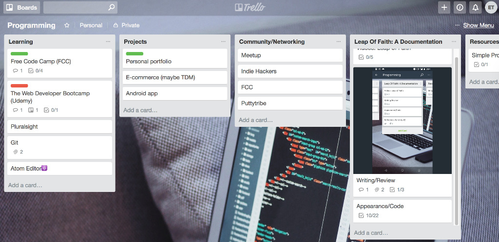
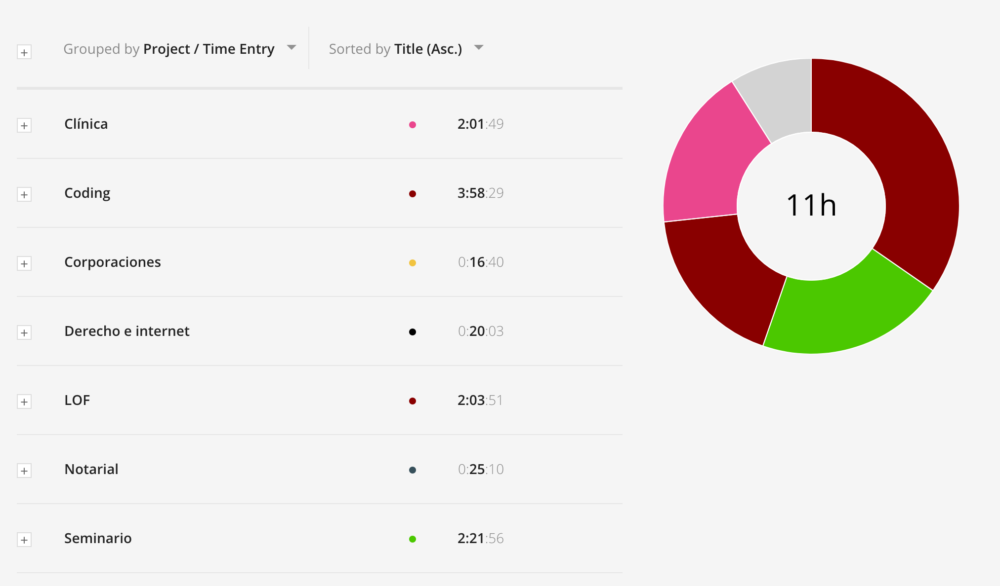
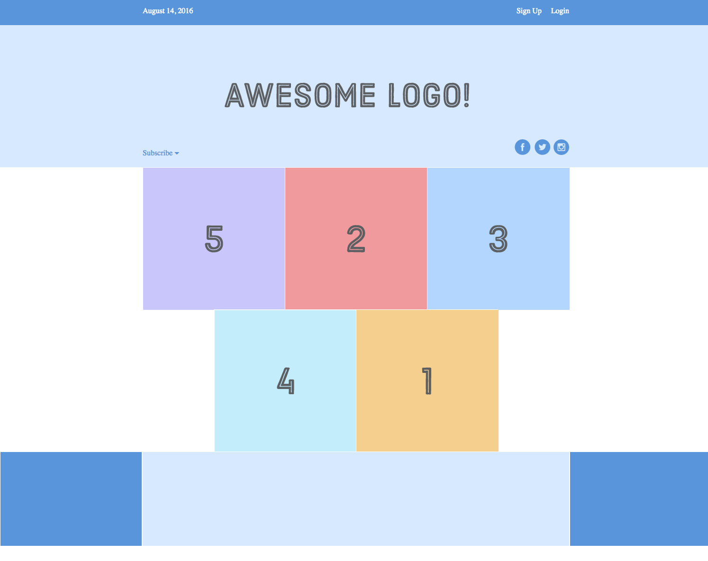
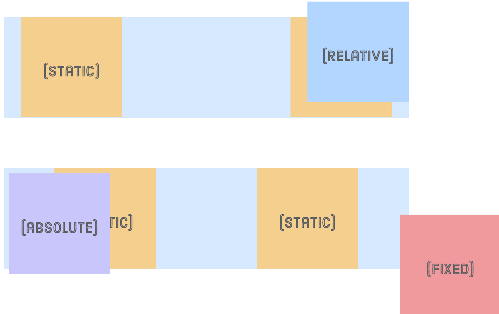

The word productivity has become quite popular lately. I've become quite a productivity geek myself. Sometimes I even find myself trying to be productive in my personal life. In this post, nonetheless, I just want to talk about how I’m dealing with productivity on the LOF: what productivity is for me, how I keep it up, what tools I use and how they’ve been working so far.

#### What Is Productivity For Me?
In my opinion, productivity is a complex term. When carefully examined, it can have different meanings for different people. It can even be the subject of a philosophical conversation dealing with questions such as: “what is productivity?”, “when is productivity worth it?” or even “is productivity useful or necessary in life?” But we won’t deal with those questions, at least not now (hit me up if you want to philosophize about those; I’m always down for a philosophical conversation). Productivity, to me, is sort of like the input of an activity from which you expect to have a determined result or output. Depending on how high or low your productivity level is, you’ll get a high or low quality level result.

I believe that productivity is necessary to be as efficient as possible when working on a specific activity. To me, the combination of mindset and execution are essential in the productivity formula. I think motivation and discipline play a huge role in the mindset part, while organization and systematization play a huge role in the execution part. The idea behind this post is not to exhaust the productivity topic but to lay out a few aspects of it and how it looks when applied to the LOF. In an effort to keep it short, I’ll jump straight to those two parts of the formula.

#### Productivity Mindset
I don’t claim to have the ideal or the best productivity mindset. In fact, I don’t even think that there is such thing. I think that the ideal or best productivity mindset is the one that gives **YOU** the results that **YOU** want. Of course, this requires honesty from oneself when asking questions like: "Am I producing what I intended or planned to produce?", “Is the level of my results equivalent to my level of productivity?”, "Am I satisfied with the results in proportion to the effort?", among others.

Having a productive mindset also requires maintenance. In order for me to have a maintained and clear mindset I meditate every morning, I exercise every day and I make sure that I make some time in my schedule to relax with friends or family. That last one is probably the hardest. It seems counterintuitive that in order to be productive you have to take time off. Although that thought is starting to become more popular, most people believe that more hours equal more production. They value quantity over quality and I couldn’t disagree more, at least in my current situation. Maintaining a productivity mindset requires discipline and commitment which require building and care, but that might be the topic of another post.

#### Productivity Execution
This is the obvious one: in order for one to be productive, the mindset is not enough. You have to execute. This is where tools come in handy. My productivity toolkit for the LOF (and life in general) is: [Evernote](https://evernote.com), [Google Calendar](https://calendar.google.com), [Trello](https://trello.com), [Habitica](https://habitica.com/), and any [Pomodoro](https://en.wikipedia.org/wiki/Pomodoro_Technique) timer (although I’m using [Toggl](https://www.toggl.com)). My system is the following: I use Trello to break down the big goals into smaller chunks (see image below of how my Trello “Programming” board looks like right now). Those smaller chunks, I either transform them into to-dos--and set a due date for them on my Google Calendar--or into dailies or habits and I set them in Habitica. Habitica is a gamified to-do list and habit tracker. _Dailies_ mean activities I have to do every day or every X amount of days and _habits_ mean...well, you know what a habit is.

*This is my Trello Programming Board. Each list corresponds to a different aspect of the LOF project.*

Evernote is a powerful note-taking app which I use to “process mind-clearing notes.” That basically means that every time that something that I need to do later comes to mind, I write it down in an effort to "clear my mind." Since most of the time these things come to mind when you’re busy doing something else, you don’t interrupt your current activity by setting a due date for them at that precise moment. Processing these notes is one of my Habitica dailies, for example. That means that once every day, I look at those notes and transform them either into to-dos, dailies, habits or wherever they correspond. I also use Evernote to write blog posts.

Last but not least: the Pomodoro technique. I use the Pomodoro technique for almost everything that requires focus. It reminds me that I have to focus for a certain amount of time but it also reminds me to take a break. My sessions for every activity I time last 25 minutes with a 5 minute break. Every four sessions I take a 25 minute break, usually to grab a snack. I track my time with my phone's clock or with an app called [Be Focused](https://itunes.apple.com/us/app/be-focused-focus-timer/id973130201?mt=8). However, since I’ve started LOF, I’ve been using an app called Toggl because it graphs the sessions and allows me to visualize my time invested much better. I believe that strategized and planned breaks of different duration are essential in productivity systems.

*This is an example of how the time I've invested per activity, during my week, looks like (the ones besides "LOF" and "Coding" have to do with my classes).*

#### Productivity and the LOF
As you can see from the previous image, I’ve been dedicating quite a lot of time to the LOF and to coding practice. I’ve been dedicating way more time to them than I was expecting. This is my sixth entry in less than a month, when I originally expected to post around two per month. As you can expect, I’m happy with the productivity results. In this section, I’ll do a quick run-through about productivity on the LOF in these different aspects: technical aspects, blogging aspects and motivational aspects.

#### Technical Aspects: HTML/CSS
I mentioned in the previous posts that I’ve jumped board and started with HTML/CSS. You’ll be seeing a lot of HTML/CSS entries in the next blog posts since it’s what I’ll be delving into the most. I’ve been following the highly recommended [Interneting Is Hard](https://internetingishard.com/) tutorial. I’ve already completed nine of its fourteen chapters. Once completed, I plan on taking a few personal projects, including free websites for friends, in order to start the practice and problem solving stage, which I believe is the most important. I would use the tutorial for referencing when needed (which I will need). In those projects, I will attempt to use HTML/CSS only. Here are a few examples of what I’ve been doing.

*Creating a dropdown menu only with HTML/CSS.*

*This is a combination of images and code to learn about <a href="https://developer.mozilla.org/en-US/docs/Web/CSS/CSS_Flexible_Box_Layout/Basic_Concepts_of_Flexbox">flexbox</a>.*

*...and this is the project from the positioning lesson.*

While these are not masterpieces, they’re a very clear and fun way to understand complex aspects of CSS such as flexbox, positioning and dropdown menus.

I also jumped into the [freeCodeCamp](https://www.freecodecamp.org/) lessons which, to my surprise, seemed to be very basic and general. I didn’t expect them to be deep and thorough lessons, but I didn’t think they would be so basic and general either. After an hour or so, I had already finished the HTML/CSS lessons and had started with Bootstrap; I hadn’t even covered 1/3 of what I've covered with Interneting Is Hard (Bootstrap is magic, BTW)! With that said, my productivity satisfaction level with the coding studies: 5 stars but a bit skeptical on freeCodeCamp. I won't discard it yet though.

#### Technical Aspects: Email
As you may have noticed, there is a subscribe button on the header and the footer. This is rather new. My intention is not spamming or marketing, but keeping the subscribers up to date of what’s going on. I’ve only set up one automatic email when people subscribe. The next day after they subscribe, they basically get a thank you email: I did it with [MailChimp](https://mailchimp.com/). There’s also a chapter on transactional and marketing emails on the [Udemy course](https://www.udemy.com/the-complete-wordpress-website-business-course/) I mentioned in one of the previous posts. I plan on watching it whenever I want to get a little bit more into the nitty-gritty of emailing. Productivity satisfaction level: 5 stars.

#### Blogging
This is the third blog post I’m writing on the same week so upfront I’ll say that I’m satisfied with the blogging productivity level. My writing method has changed dramatically since the beginning. The first posts were typed on my phone as they came out of my mind. Progressively, I've started adding headers to different sections, dividing into a coherent and themed layout, and now I design the post layout before starting to write. This post begun as a bullet list of sections and key concepts I wanted to cover per section. Since I already had the idea of what I wanted to write, once the bullet list was set, the writing process was rather fluent and I just had to go back to the bullets to see what was I going to talk about next.

#### Motivation
As you might have guessed, motivation is one of my favorite aspects of productivity. But that’s because I believe it’s one of the most important, if not the most. I think that lack of motivation is one of the biggest reasons of why people stop going to the gym. At this point of the LOF, it is very easy to have motivation: it is a new and exciting project and it doesn’t feel like work but more like a hobby. I would be too naive if I thought that that’s how it will forever be. In a previous post, I mentioned how I thought I’ve hit the dip: I don’t think I’ve hit the dip. I’m in the infatuation phase. I've changed colors, font families and a few other things in the CSS stylesheets and I couldn’t be happier. I won’t forget, however, that many experienced coders remind newcomers that this is just the first phase before I hit the wall (it just occurred to me that I’ll listen to [The Wall](https://en.wikipedia.org/wiki/The_Wall) when it needs some breaking). Lack of motivation is not an obstacle to my productivity, for now...

### Productivity Marathon
In other news, last Saturday, I was part of a productivity marathon called [the PuttyThon](https://puttylike.com/what-would-you-do-with-24-hours-of-free-time/). As I mentioned in the first two posts, I started to try a different aspect of productivity that many recommend: communities. The PuttyThon was basically a 24-hour video call where puttypeeps would join and work on their projects for any amount of time they desired. As expected, I worked on the LOF. As unexpected, I ended up being interviewed on a podcast in which I talked about the LOF, my short and medium term goals, and about it in general (you can listen to the interview [here](http://hwcdn.libsyn.com/p/d/a/8/da83d01d7fb47da9/The_MultiPod_007_The_Puttython_24_Hours_of_Focused_Multipotentiality.mp3?c_id=20088837&expiration=1522624581&hwt=289430518fa558d8f4c39f2a4362250e) [*update 2018*: this episode is no longer available through this link, however, you can find it on iTunes by clicking the following link; it is episode 19] or check out the podcast on iTunes [here](https://itunes.apple.com/us/podcast/the-multipod/id1325796228?mt=2&ls=1#episodeGuid=https%3A%2F%2Ftheputtytribe.com%2F%3Fp%3D36208); the time stamp for my interview is at [28:17], if you want to jump straight to it). If you want to know more about the PuttyTribe or the Puttython, I invite you to listen to the podcast. I must say that it works, from a productivity standpoint. However, I ended up having more fun by meeting other peeps than by actually producing.

That’s enough productivity for now! Expect new posts and definitely a sequel of productivity on the LOF.