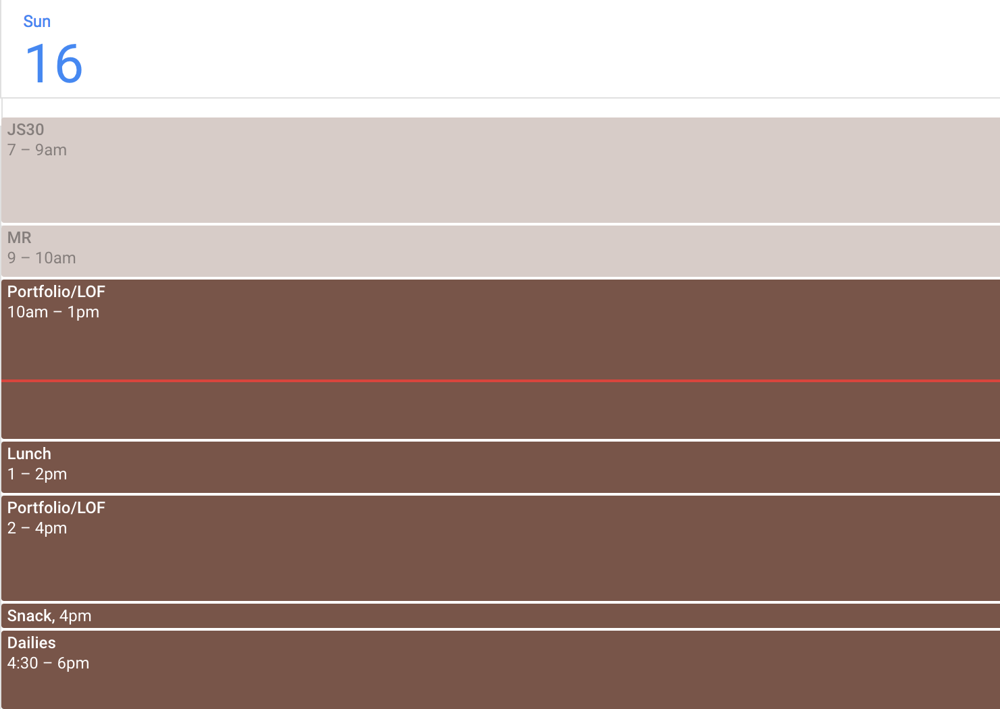

I have **A LOT** of work to do. I started the web development training once again as of November 1st. As you might already know, I have until early January, roughly speaking, to “formalize” my title as a web developer and actually do something concrete about it, professionally speaking. What comes next? Who knows! I might have some ideas though…anyway, given the fact that I have so much training to do, this will be the last post regarding productivity. From now on, the posts will be daily posts of what I’ve learned during that day; problems I’ve encountered or anything pertinent about that day, but they’ll mostly be code related. They won’t be the most readable posts either since I won’t spend too much time with them; I want to focus mostly on the training. I still don’t know what I’ll do with all that data, which will basically be a journal, but I guess something useful could come out. But more on that later. For now, I want to cover the last essential aspect of my productivity collection: timeboxing.

#### What is timeboxing?
It’s fairly simple. Timeboxing is, essentially, a way of planning your day minute by minute or hour by hour. That means that when the day starts, you already now what you’ll be doing at every moment of that day. This might sound weird to some, but I promise that productivity wise it makes a lot of sense. I use it for almost everything though, that way I don’t neglect other important aspects of my life.

#### How to timebox
Basically, just choose any calendar or agenda and plan your day. That’s it really. Sounds simple, but it can be hard. There are many elements that come in play that complicate the scenario, for example, unexpected events. Eventually, when you get in the habit of timeboxing your days, you’ll start to get an intuitive feel of how a day makes sense to you. You’ll know more or less how much time you need to also do your daily chores like cooking or eating. For me, it is important to know how my energy levels work so I can set my tasks in harmony with them. I set lectures in the morning because I’m more alert and the coding practice in the afternoon because, for me, it requires less energy. It’s a very personal practice.

#### A timebox example
How to organize your timebox will depend on your goals or tasks that you want to achieve or complete. That way you’ll break them down in smaller tasks and those tasks will take part of your days. Since I’m just starting with a new routine, I plan “trial timeboxed” days. What that means is that since I don’t know yet how I get into the routine, I timebox my days but with flexibility to modify them until I hit the spot. Depending on the day of the week, my timebox changes too. For example, a Tuesday for me looks like this (this is taken from Google Calendar since that’s where I timebox):

Like I said, I plan everything: my morning routine, the commute time, when I eat and cook, when I shower, what specific tasks I do, etc. This changes every day, of course. It doesn’t mean I’m 100% strict with it, but I’m 90% strict. I leave that 10% flexibility for the unexpected and unavoidable happenings of life. It’s just a matter of taste.

#### Try timeboxing
If there’s an aspect of life that you want to improve, be it productivity, relationships, exercising or any other, try timeboxing. It might seem weird at first, unnatural or simply like a lot of work, but if you’re already into the habit of planning your days ahead of time (which you should if you want to achieve things), then it’s really not much more time. I timebox each day for the next day. Try it out! There are also many resources online regarding timeboxing, but it really isn’t much more complicated than what I just explained. The biggest challenge is finding your sweet spot, but that’ll come by itself.