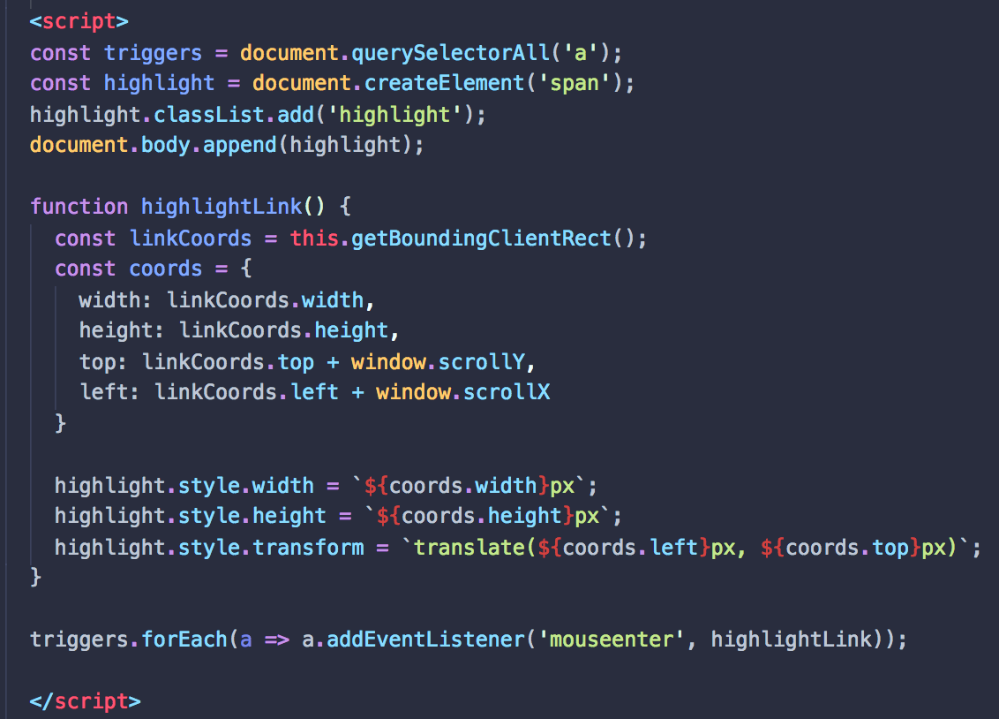

This is yet another one of those cool yet simple projects from [JavaScript 30](https://javascript30.com). [Check it out](https://eduardoltorres.github.io/follow-links/)!

The solution is not complicated at all. In fact, it's rather clever.

You see that little trick there where you input external values as properties in one shot? That's pretty handy and perhaps one of the biggest lessons I've taken from JS30. I've found myself using it over and over again. Keep it close.

Happy New Year, by the way! See you in 2019! 🎉🎊