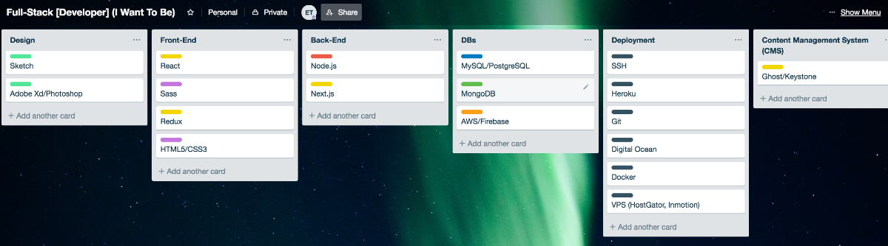

I've created a Trello board of the web developer I want to become in 2019.

Each column is a domain and each card is a technology corresponding to that domain. This is what it looks like.

These are not all of the technologies that I want to get into nor this means that I want to be proficient in all of them. These are the technolgoies that I think would make me the web developer I want to be if I were to master them all, but that is not the purpose. The board's purpose is to delineate a road even if it changes further on.

**My goal for now is to be proficient at least in the MERN (MongoDB, Express, React, Node.js) stack although I leave the door open for changes.**

As of now, I'm working on React. Then I'll work with Node.js and Express, MongoDB and finally a deployment service like Heroku. I feel that with those technologies I can build pretty much any webpage or web app.

After feeling comfortable with the MERN stack, it might be wise to get into some designing. Designing + MERN stack seems to me a pretty well rounded stack to start getting some serious freelance or remote work. Like I said, I'll modify if necessary.

This is my web development goal for 2019. What's yours? Tell me on [Twitter](https://twitter.com/_eduardoltorres).